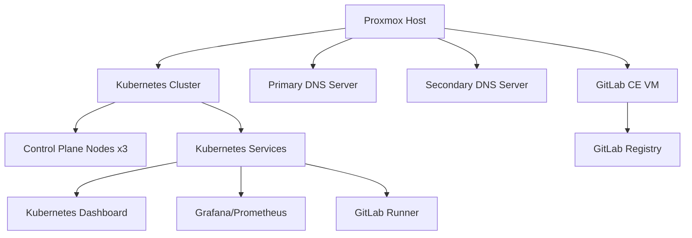

# SAE601 Infrastructure Project

## Project Overview

This project implements a complete infrastructure environment using Proxmox virtualization, including GitLab CE, a Kubernetes cluster, DNS services, and monitoring systems. The infrastructure is deployed using Infrastructure as Code (IaC) principles with Terraform to ensure reproducibility and maintainability.

## Infrastructure Components



### Proxmox Virtualization
- Serves as the hypervisor for all VMs
- Managed via API through Terraform providers
- Custom VM templates with cloud-init support

### GitLab CE
- Complete DevOps platform with integrated CI/CD
- Container registry for Docker images
- SSL-secured with self-signed certificates
- User authentication and project management

### Kubernetes Cluster
- Three control plane nodes configured for high availability
- No separate worker nodes (control planes also schedule workloads)
- Deployed and managed using Kubespray
- Integrated with GitLab CI/CD via runners

### DNS Servers
- Primary and Secondary DNS servers for high availability
- Internal DNS resolution for all services
- BIND9 configuration for local domain name resolution
- Master-slave replication for zone transfers

### Monitoring Stack
- Prometheus for metrics collection
- Grafana for visualization and dashboards
- Monitoring of Kubernetes cluster health and performance

## Technical Specifications

| Component | CPU | Memory | Storage | Network |
|-----------|-----|--------|---------|---------|
| GitLab VM | 4 cores | 16GB | 32GB | Bridge mode |
| K8s Control Plane | 4 cores | 12GB | 32GB | Bridge mode |
| Primary DNS Server | 1 cores | 512MB | 8GB | Bridge mode |
| Secondary DNS Server | 1 cores | 512MB | 8GB | Bridge mode |

## Prerequisites

- Proxmox VE server with API access
- Internet connection for package downloads
- At least 64GB RAM and 16 CPU cores on the Proxmox host
- 128GB+ available storage
- Ubuntu 24.04 and Debian 12 cloud images

## Installation Guide

### 1. Proxmox API Setup

Before deploying with Terraform, set up the Proxmox API:

```bash
# Create a dedicated Terraform user
pveum user add terraform@pve

# Create custom role with required permissions
pveum role add Terraform -privs "Datastore.Allocate Datastore.AllocateSpace Datastore.AllocateTemplate Datastore.Audit Pool.Allocate Sys.Audit Sys.Console Sys.Modify SDN.Use VM.Allocate VM.Audit VM.Clone VM.Config.CDROM VM.Config.Cloudinit VM.Config.CPU VM.Config.Disk VM.Config.HWType VM.Config.Memory VM.Config.Network VM.Config.Options VM.Migrate VM.Monitor VM.PowerMgmt User.Modify"

# Assign role to the user
pveum aclmod / -user terraform@pve -role Terraform

# Generate API token
pveum user token add terraform@pve provider --privsep=0
```

### 2. Create VM Templates

Create an Ubuntu 24.04 cloud-init template:

```bash
# Download cloud image
wget -P /var/lib/vz/template/iso/ https://cloud-images.ubuntu.com/daily/server/releases/24.04/release/ubuntu-24.04-server-cloudimg-amd64.img

# Create template VM
qm create 9000 --name "ubuntu-cloud-init-template" --memory 2048 --cores 2 --net0 virtio,bridge=vmbr0
qm importdisk 9000 /var/lib/vz/template/iso/ubuntu-24.04-server-cloudimg-amd64.img local-lvm
qm set 9000 --scsihw virtio-scsi-pci --scsi0 local-lvm:vm-9000-disk-0
qm set 9000 --boot c --bootdisk scsi0
qm set 9000 --ide2 local-lvm:cloudinit
qm set 9000 --ipconfig0 ip=dhcp
qm set 9000 --ciuser ubuntu --cipassword 'ubuntu'
qm set 9000 --agent enabled=1

# Convert to template
qm template 9000
```

### 3. DNS Servers Deployment

```bash
# Navigate to the DNS Terraform directory
cd terraform/dns

# Initialize and apply Terraform
tofu init
tofu validate
tofu plan -out=plan.out
tofu apply plan.out

# This will deploy both primary and secondary DNS servers
# Primary server will be configured as the master
# Secondary server will be configured as a slave
```

### 4. GitLab Deployment

```bash
# Generate SSL certificate
openssl genpkey -out gitlab.basile.uha.fr.key -algorithm RSA -pkeyopt rsa_keygen_bits:2048
# Create certificate config (see docs/gitlab.md for details)
# Generate and sign certificate

# Navigate to the GitLab Terraform directory
cd terraform/gitlab

# Initialize and apply Terraform
tofu init
tofu validate
tofu plan -out=plan.out
tofu apply plan.out

# The deployment will automatically:
# - Create the VM
# - Install GitLab CE
# - Configure SSL
# - Set up the container registry
```

### 5. Kubernetes Cluster Deployment

```bash
# Set up Python environment
cd kubespray
pyenv install 3.12
pyenv local 3.12
python -m venv .venv
source .venv/bin/activate
pip install --upgrade pip
pip install -r requirements.txt

# Navigate to the Kubernetes Terraform directory
cd terraform/kubernetes

# Initialize and apply Terraform
tofu init
tofu validate
tofu plan -out=plan.out
tofu apply plan.out

# Deploy Kubernetes with Kubespray (control planes only)
ansible-playbook cluster.yml -b -v

# Configure kubectl
mkdir -p ~/.kube
sudo cp /etc/kubernetes/admin.conf ~/.kube/config
sudo chown $(id -u):$(id -g) ~/.kube/config
```

### 6. Kubernetes Add-ons Deployment

#### Kubernetes Dashboard

```bash
# Apply the dashboard ingress configuration
kubectl apply -f k8s/dashboard/dashboard-ingress.yaml

# Create service account and permissions
kubectl create serviceaccount dashboard-admin -n kube-system
kubectl create clusterrolebinding dashboard-admin --clusterrole=cluster-admin --serviceaccount=kube-system:dashboard-admin

# Create authentication token
kubectl apply -f - <<EOF
apiVersion: v1
kind: Secret
metadata:
  name: dashboard-admin-token
  namespace: kube-system
  annotations:
    kubernetes.io/service-account.name: dashboard-admin
type: kubernetes.io/service-account-token
EOF

# Get the token
kubectl get secret dashboard-admin-token -n kube-system -o jsonpath="{.data.token}" | base64 --decode
```

#### Monitoring Stack (Grafana & Prometheus)

```bash
# Create namespace
kubectl create namespace monitoring

# Create persistent volumes
kubectl apply -f k8s/grafana/grafana-pv.yaml
kubectl apply -f k8s/prometheus/prometheus-pv.yaml
kubectl apply -f k8s/grafana/grafana-pvc.yaml

# Install Prometheus
helm repo add prometheus-community https://prometheus-community.github.io/helm-charts
helm repo update
helm install prometheus prometheus-community/prometheus --namespace monitoring --values k8s/prometheus/values.yaml

# Install Grafana
helm repo add grafana https://grafana.github.io/helm-charts
helm repo update
helm install grafana grafana/grafana --namespace monitoring --values k8s/grafana/values.yaml

# Apply ingress configuration
kubectl apply -f k8s/grafana/ingress.yaml
```

#### GitLab Runner

```bash
# Create namespace
kubectl create namespace gitlab-runner

# Install GitLab Runner
helm repo add gitlab https://charts.gitlab.io
kubectl apply -f k8s/runner/cert-secret.yml
helm install --namespace gitlab-runner gitlab-runner -f k8s/runner/values.yaml gitlab/gitlab-runner
```

## Access Information

### GitLab
- URL: https://gitlab.basile.uha.fr
- Initial admin setup will be required on first access
- Container Registry: gitlab.basile.uha.fr:5050

### Kubernetes Dashboard
- URL: As specified in the ingress configuration
- Authentication: Using the token generated during setup

### Grafana
- URL: As specified in the ingress configuration
- Default credentials: admin/admin

## Troubleshooting

### GitLab Issues
- Check service status: `gitlab-ctl status`
- View logs: `gitlab-ctl tail`
- Reconfigure if needed: `gitlab-ctl reconfigure`

### Kubernetes Issues
- Check node status: `kubectl get nodes`
- View pod status: `kubectl get pods --all-namespaces`
- Check logs: `kubectl logs <pod-name> -n <namespace>`

### DNS Issues
- Check service status: `systemctl status named`
- Verify zone transfers: `dig @secondary-dns-ip basile.uha.fr axfr`
- Check logs: `journalctl -u named`

### Monitoring Issues
- Verify PVC status: `kubectl get pvc -n monitoring`
- Check service availability: `kubectl get svc -n monitoring`
- Access Prometheus UI to check targets status

## Documentation References

For detailed documentation on specific components, refer to:
- [Proxmox API Token Setup](docs/token.md)
- [Ubuntu Cloud-Init Template Creation](docs/template.md)
- [Terraform Deployment Projects](docs/terraform.md)
- [GitLab Installation Guide](docs/gitlab.md)
- [Kubernetes Cluster Setup](docs/kubernetes.md)
- [Kubernetes Dashboard Configuration](docs/kube-dash.md)
- [GitLab Runner Setup](docs/runner.md)
- [Grafana and Prometheus Setup](docs/grafana.md)

